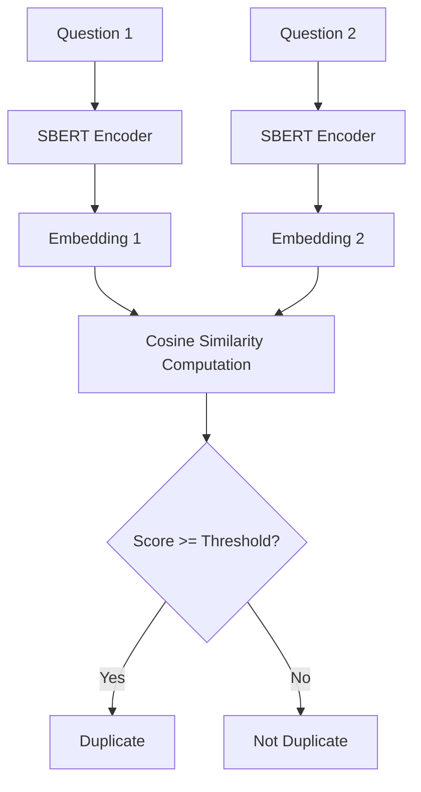

# SBERT: Semantic Similarity and Duplicate Question Detection

This repository implements a modular, step-by-step pipeline to fine-tune **Sentence-BERT (SBERT)** using the `sentence-transformers` library to detect duplicate question pairs (semantic similarity) on the Quora Question Pairs dataset.

By leveraging Siamese network architectures and contrastive learning, this project encodes sentences into dense vector embeddings and computes their cosine similarity to predict whether two questions carry the same meaning.

---

## 📂 Project Architecture

The project is structured into logical steps, separating configuration, data utilities, modeling, and evaluation:

```
SBERT/
├── dataset/                  # Dataset directory
│   ├── train.csv             # Training dataset
│   └── test.csv              # Test/Evaluation dataset
├── output/                   # Fine-tuned model checkpoints and predictions
├── src/                      # Source code
│   ├── step1_config/         # Configuration
│   │   └── config.py
│   ├── step2_utils/          # System/Device utilities and logger
│   │   ├── device.py
│   │   └── logger.py
│   ├── step3_data/           # Data loading and format mapping
│   │   ├── examples.py
│   │   └── loader.py
│   ├── step4_evaluation/     # Validation evaluator and testing suite
│   │   ├── evaluator.py
│   │   └── tester.py
│   ├── step5_model/          # Model training and prediction interface
│   │   ├── predictor.py
│   │   └── trainer.py
│   ├── train.py              # Main training entry point
│   ├── test.py               # Main evaluation entry point
│   └── predict.py            # CLI-based real-time prediction script
├── requirements.txt          # Python dependencies
└── README.md                 # Project documentation (this file)
```

---

## 🚀 Getting Started

### 1. Installation
Clone the repository and install the dependencies listed in [requirements.txt]:

```bash
pip install -r requirements.txt
```

### 2. Dataset Setup
Taken from [kaggle](https://www.kaggle.com/competitions/quora-question-pairs/data).

Ensure your training and test datasets are placed in the `dataset/` folder:
- **Training**: [dataset/train.csv] (should contain `question1`, `question2`, and `is_duplicate` labels)
- **Testing**: [dataset/test.csv] (with similar structure for evaluation, or unlabeled to save predictions)

---

## 🛠️ Pipeline Details

The project is broken down into modular steps:

### ⚙️ Step 1: Configuration
Global parameters are managed in [config.py]. Here you can configure:
* **Model Backbone**: Defaulting to `sentence-transformers/all-MiniLM-L6-v2`.
* **Hyperparameters**: `BATCH_SIZE` (64), `EPOCHS` (3), learning rate warmups, random state, etc.
* **Sampling Limits**: `MAX_SAMPLE` (10,000) controls the training scale for speed and memory efficiency.
* **Threshold**: `SIMILARITY_THRESHOLD` (0.80) determines the boundary for classifying duplicates.

### 💻 Step 2: Utilities
* [device.py]: Automatically selects the best available device (`cuda`, `mps` for Apple Silicon, or `cpu`) and sets optimized CPU threading parameters using `multiprocessing.cpu_count()`.
* [logger.py]: Configures standardized logging format across all modules.

### 📊 Step 3: Data Loader
* [loader.py]: Loads the Quora dataset CSV files, cleans invalid/missing fields, and supports sampling.
* [examples.py]: Converts text rows into `InputExample` objects required by `sentence-transformers`.

### 🧪 Step 4: Evaluation & Testing
* [evaluator.py]: Constructs a `BinaryClassificationEvaluator` which calculates cosine similarity on validation pairs and computes metrics like Accuracy, F1, and Precision/Recall at optimum threshold.
* [tester.py]: Evaluates a test set on a trained model checkpoint. If target labels are missing, it automatically saves predicted duplicate labels to `output/predictions.csv`.

### 🤖 Step 5: Model & Training
* [trainer.py]: Performs fine-tuning using `losses.ContrastiveLoss` and saves the best model directly to the `output/` directory.
* [predictor.py]: Exposes `SBERTPredictor` class for single/batch inference using cosine similarity.

---

## 🏃 How to Run

### Training the Model
Fine-tune SBERT on your dataset:
```bash
python src/train.py
```
This runs the trainer [train.py] which loads training samples, performs validation splits, computes contrastive loss, and outputs the optimal model weights to the `output/` directory.

### Evaluating the Model
Test the model checkpoint against your test dataset:
```bash
python src/test.py
```
This runs [test.py] using the predictions and evaluator definitions.

### Running Real-time Predictions
To run interactive ad-hoc queries, launch the prediction CLI:
```bash
python src/predict.py
```
#### Example Interaction:
```text
Question 1: How do I learn Python?
Question 2: What is the best way to start learning Python?
Similarity = 0.89
Duplicate
```

---

## 📈 Methodology Overview



SBERT encodes each sentence individually into a dense pooling representation. Unlike cross-encoders that compute self-attention over the concatenated pair (which is computationally expensive for large datasets), SBERT enables pre-computing embeddings and using quick vector comparisons (Cosine Similarity), making it suitable for production search and duplicate detection pipelines.
